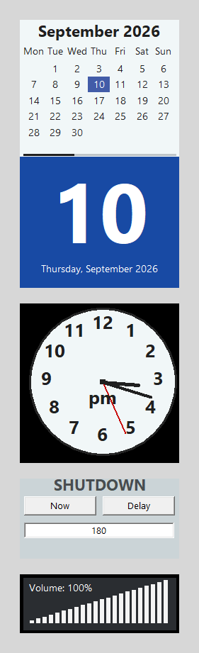

# Gadgets Win

Latest release: **v10**

Gadgets Win is a compact native Windows desktop set containing a station clock,
calendar, volume meter, and deliberately gated shutdown panel.

> **Use at your own risk.** This experimental software is provided as-is,
> without guarantees or warranties. Back up important work and review the
> source, permissions, shutdown behaviour, and
> [full experimental-use notice](EXPERIMENTAL_USE_NOTICE.md) before running it.

## Important shutdown warning

The **Now** control calls `shutdown.exe /p /f`, which can close applications
without warning and lose unsaved work. The **Delay** control schedules a
shutdown; while one is scheduled it changes to **Cancel**. Do not test either
control on a machine you are not prepared to shut down.

## Download and run

Download `gadgets_v10.exe` and run it on Windows. No installer is required. An
optional `gadgets_v10.ini` is created beside the executable and is intentionally
excluded from the repository.

Version 10 improves calendar repainting, adds cancellable delayed shutdown,
keeps the Settings dialog compact, and supports installed Windows SAPI/OneCore
voices in several languages. It does not download voice packs.

See [README_v10.md](README_v10.md) for complete behaviour and
[V10_PROGRESS_2026_09_02.txt](V10_PROGRESS_2026_09_02.txt) for verification
details. The included offline test does not launch the app, speak, or invoke
`shutdown.exe`.

## Screenshot safety

The screenshot was captured from a fresh isolated copy. No controls were
clicked, no speech was played, and no shutdown command was invoked.
